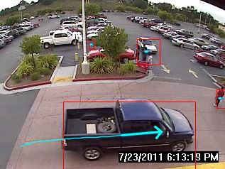

# Motion Detection Application
An object motion detection application with background subtraction technique. Implemented with C++ and OpenCV. A project submitted to my university subject, UCCC2513 Mini Project.

## Features
- Compute the background after a training phase
- Support dynamic background (background with movement, see results below)
- Compute the foreground mask
- Compute bounding box of objects
- Compute path of moving objects
- Compute velocity of moving objects

## Results
**Video Sample Input 1 - Static Background**

| Input Frame | Result |
|:-----------:|:------:|
| **Background** |  |
|  |  |
|  |  |
|  |  |

 

 

**Video Sample Input 2 - Dynamic Background (Moving Fountain Water)**

| Input Frame | Result |
|:-----------:|:------:|
| **Background** |  |
|  |  |
|  |  |
|  |  |

## Improvement
- [ ] usage of LAB color space
- [ ] adaptive background
